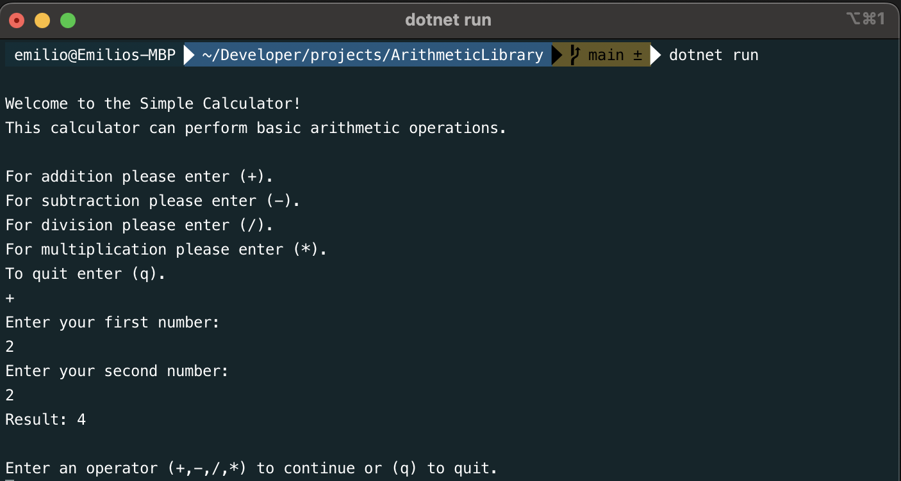

ArithmeticLibrary is a simple .NET 7 console application that performs basic arithmetic operations, demonstrates reuse, and includes unit tests. Follow the steps below to get started with the project.

Prerequisites
Before running the project or tests, make sure you have .NET 7 installed on your machine. If you don't have it installed, you can download it from https://dotnet.microsoft.com/en-us/download

Running the Project
To run the ArithmeticLibrary project, follow these steps:

Open your terminal or command prompt.

>cd user/.../ArithmeticLibrary

Run the project using the following command:

>dotnet clean

>dotnet build

>dotnet run

Running Tests in Visual Studio Code (VSCode)
ArithmeticLibrary includes unit tests that you can run using Visual Studio Code (VSCode). Follow these steps:

Open the ArithmeticLibrary project in Visual Studio Code.

In the Visual Studio Code Explorer, locate the "ArithmeticLibraryTest" folder.

Inside the "ArithmeticLibraryTest" folder, you will find test classes with methods to test different parts of the project.

To run tests, you can use the built-in test runner in VSCode. Above any test method, you should see a "Run Test" option.
